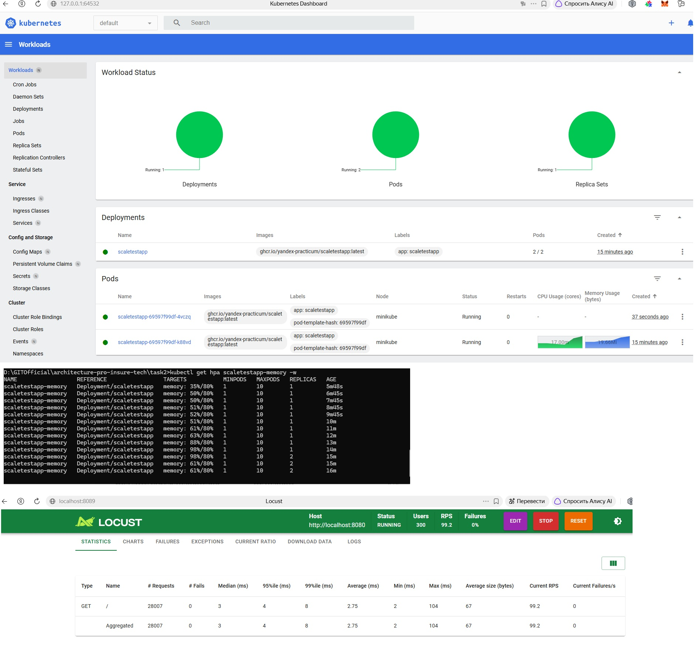
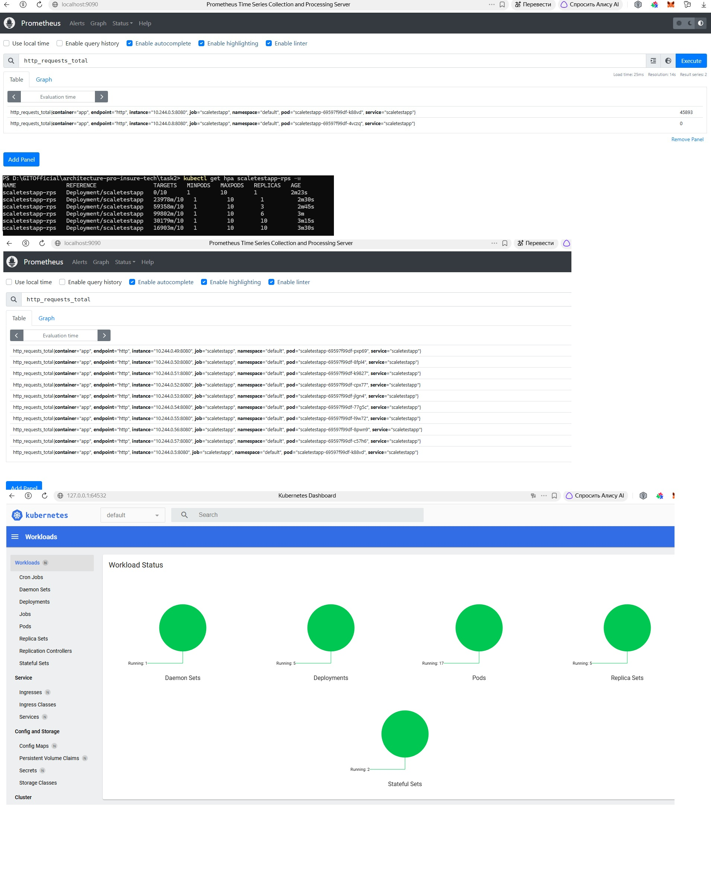

# Задание 2. Динамическое масштабирование контейнеров

## Часть 1. Динамическая маршрутизация на основании показателей утилизации памяти

## Часть 2. Динамическая маршрутизация на основании показателей количества запросов в секунду
